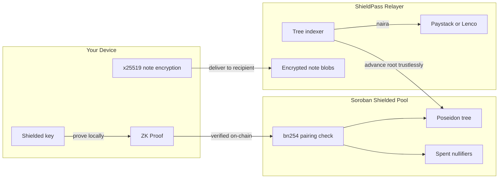

# How It Works

A step-by-step user journey, the cryptographic pipeline behind it, how private payments stay private, and the progressive KYC model.

## A User Journey

Meet **Tobi**, who wants to use ShieldPass:

**1. Onboard (invisible funding).** Tobi signs up with a Passkey (Face ID). His **shielded identity** (spending + encryption keys) is derived from the passkey itself. ShieldPass mints him a secret **note** worth 500 XLM — no public transaction happens. To the outside world, his wallet holds $0.

**2. Shield / Unshield.** Tobi can move his own crypto — **XLM or USDC** — **into** the private pool (Shield) or pull it back **out** to his wallet (Unshield) at any time.

**3. Withdraw to Naira.** Tobi cashes out 100 XLM. On his phone a ZK proof spends his note, mints a 400 XLM change note, and authorizes the contract. The backend pays his bank via Paystack/Lenco; the change stays private.

**4. Send privately.** Tobi sends 50 XLM to a friend by **email or `shp_` address**. A `shielded_transfer` proof moves the value inside the pool — **fully private**. His friend's app scans, decrypts the note, and their shielded balance just goes up. A 🔔 notification fires.

**5. Stay informed.** Every action — faucet, shield, unshield, withdraw, send, and **received payments** — lands in an in-app **Activity feed** with an unread badge.

---

## Cryptographic Pipeline

Three Circom/Groth16 circuits over BN254, all **verified on-chain**:

1. **`confidential_swap` (browser):** proves you own a valid note, derives the spend `nullifier`, and computes the change. Used by **Withdraw** and **Unshield**. `swap_amount` is public here (real value leaves the pool).
2. **`shielded_transfer` (browser):** spends one note → **two** output notes (recipient + change). **Amounts are private**; the recipient's owner tag is bound into the proof. Powers **private P2P payments**.
3. **`merkle_insert` (backend):** proves each `old_root → new_root` tree append so the pool's commitment tree advances **trustlessly** — no on-chain hashing needed.

See [Contracts, Circuits & SDK](/contracts-and-sdk) for the full function/module reference these circuits plug into.

---

## Private Payments: How It Stays Private

Sending to another ShieldPass user keeps everything hidden, like a locked mailbox with no names:

1. You encrypt the note details to the recipient's published **encryption key** (x25519 ECDH + XChaCha20-Poly1305) and submit the `shielded_transfer`.
2. The funds **never leave the pool** — your note is nullified; the recipient gets a new note; nothing public is revealed.
3. The recipient's app **scans** new encrypted blobs, trial-decrypts with their key, finds the ones meant for them, and updates their shielded balance — automatically, with a notification.

> Sending to an external `G…`/`C…` wallet instead **unshields** (the funds become public on arrival). Sending to a ShieldPass user stays **fully shielded**.

---

## Progressive KYC — Programmable Privacy

A **tiered** compliance model so small swaps stay frictionless while large ones stay regulated:

| Tier | Gate | Unlocks |
|---|---|---|
| **Tier 1** | Passkey **hardware attestation** (`hardware_attested`) | Everyday swaps |
| **Tier 2** | **BVN** verification (`bvn_verified`) | High-value swaps (> ₦1,000,000) |

The *same* circuit enforces both. A public input `require_bvn` is set by the backend from the swap's naira value; the contract rejects a high-value withdrawal that didn't use a Tier-2 proof. Compliance attributes are bound **into the note**. See [Security](/security) for why this makes the proof load-bearing rather than a formality.

---

## Passkey Smart Wallets + Shielded Identity

No seed phrases, no extensions, no XLM required. Each user gets an **OpenZeppelin Smart Account** secured by a WebAuthn passkey; transactions are submitted **gaslessly** via the relayer. Your **shielded key** (which owns your private notes) is derived from the **passkey's PRF** — so resetting your login PIN never touches your private funds.
